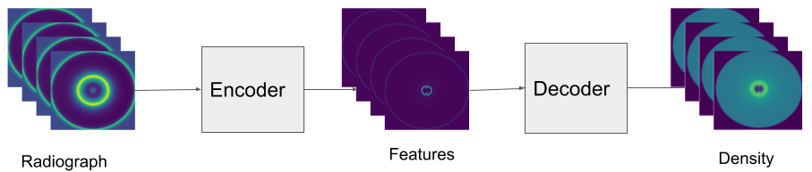
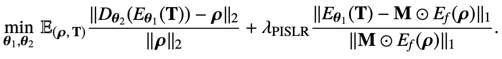
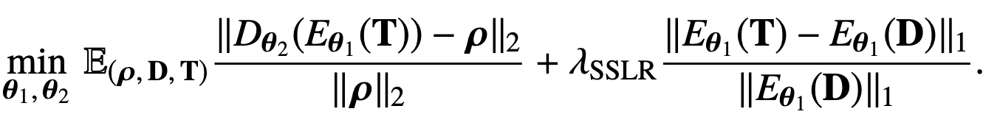
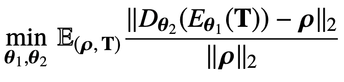
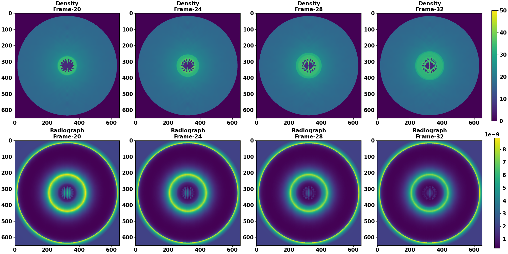
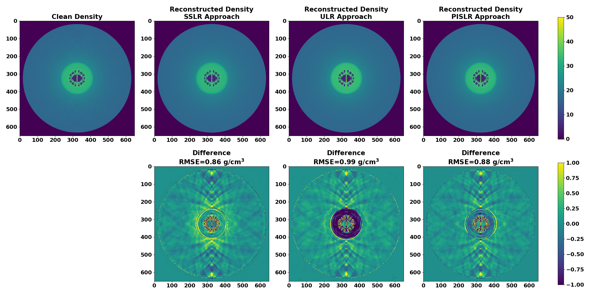
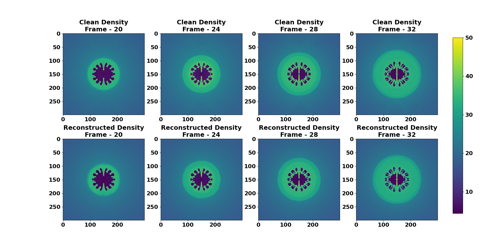

# Dynamic Tomography with Learned Robust Features

## Learning Robust Features for Scatter Removal and Reconstruction in Dynamic ICF X-Ray Tomography

Python implementation for the paper:

**Siddhant Gautam, Marc L. Klasky, Balasubramanya T. Nadiga, Trevor Wilcox, Gary Salazar, and Saiprasad Ravishankar.**  
*"Learning Robust Features for Scatter Removal and Reconstruction in Dynamic ICF X-Ray Tomography."*  
*Opt. Express* **33**, 12345-12367 (2025).  
DOI: [https://doi.org/xxxx](https://doi.org/xxxc)  

arXiv preprint [arXiv:2408.12766](https://arxiv.org/abs/2408.12766) (2024)

---

## Overview

In this work, we propose a robust feature extraction technique for scatter removal and density reconstruction in dynamic inertial confinement fusion (ICF) X-ray radiography.  
An encoder is used to extract robust features from noisy or corrupted X-ray projections, and a decoder reconstructs the underlying density image from the extracted features.

<p align="center">
  
</p>

<p align="center"><em>Figure 1: Encoder-decoder architecture used for reconstructing temporal sequences of ICF radiographs.</em></p>

We explore three strategies for the latent-space representation of features:
1. **Physics-Inspired Supervised Latent Representation (PISLR)**
2. **Self-Supervised Latent Representation (SSLR)**
3. **Unsupervised Latent Representation (ULR)**

We find that self-supervised and physics-inspired supervised feature models consistently perform better across a range of unknown scatter and noise conditions.

The loss functions for these models are as follows:

- **PISLR Approach:**
<p align="center">
  
</p>
<p align="center"><em>Figure 2: Loss formulation used for Physics-Inspired Supervised Latent Representation (PISLR).</em></p>

- **SSLR Approach:**
<p align="center">
  
</p>
<p align="center"><em>Figure 3: Loss formulation used for Self-Supervised Latent Representation (SSLR).</em></p>

- **ULR Approach:**  
<p align="center">
  
</p>
<p align="center"><em>Figure 4: Loss formulation used for Unsupervised Latent Representation (ULR).</em></p>

Where:
- $E_{\theta_1}$ and $D_{\theta_2}$ are the encoder and decoder networks with parameters $\theta_1$ and $\theta_2$.
- $D$ and $T$ are the clean and noisy radiographs, respectively.
- $\rho$ is the underlying clean density.
- $\lambda_{\text{PISLR}}$ and $\lambda_{\text{SSLR}}$ are hyperparameters controlling the weighting of the respective loss terms.
- The expectation is taken over the distribution of densities and radiographs.

---

## Code Structure

- **Data Simulation:**  
  Scripts to generate clean and noisy radiographs with varying scatter, gamma, and photon noise levels.
  
- **Model Training:**  
  Scripts to train:
  - PISLR model  
  - SSLR model  
  - ULR model  

- **Evaluation:**  
  Scripts to evaluate the learned models on radiographs corrupted by different noise and scatter levels (both in-population and out-of-population).

---

## Running the Experiments

### Data Simulation
Generate simulated radiographs with desired scatter and noise settings:
```
python generate_clean_radiograph.py
generate_noisy_radiograph
```


<p align="center">
  
</p>
<p align="center"><em>Figure 5: Clean density slice (left) and its corresponding direct radiograph (right) generated using exponential attenuation.</em></p>

### Training Reconstruction Models:
Train PISLR, SSLR, and ULR models:
```
python train_pislr_model.py
python train_sslr_model.py
python train_ulr_model.py
```


### Evaluation:
Evaluate the reconstruction performance under different noise conditions:
```
python test_all_models.py
```


Default parameters for in-population testing include:
- `sigma_scatter = 10`
- `scatter_scaling = 0.2`
- `scatter_polynomial_order = 1`

### Results on In-Population Noise and Scatter:

<p align="center">
  
</p>
<p align="center"><em>Figure 6: 2D profiles of the 32<sup>nd</sup> frame showing clean and reconstructed densities, along with error maps for different reconstruction methods. The SSLR method achieves the lowest RMSE.</em></p>

<p align="center">
  
</p>
<p align="center"><em>Figure 7: Reconstructed densities using the SSLR method for four frames (central 300×300 region). The reconstruction captures key features like the outgoing shock.</em></p>

---

## Datasets

The synthetic datasets used in this work are not publicly available due to copyright restrictions with Los Alamos National Laboratory.  
However, users may generate their own radiographs using the provided scripts and customize scatter/noise models as needed.

---

## Contact

The code is provided to support reproducible research.  
If you have any questions, suggestions, or encounter issues running the code, feel free to reach out:

- Siddhant Gautam — [gautamsi@msu.edu](mailto:gautamsi@msu.edu)  
- Saiprasad Ravishankar — [ravisha3@msu.edu](mailto:ravisha3@msu.edu)
